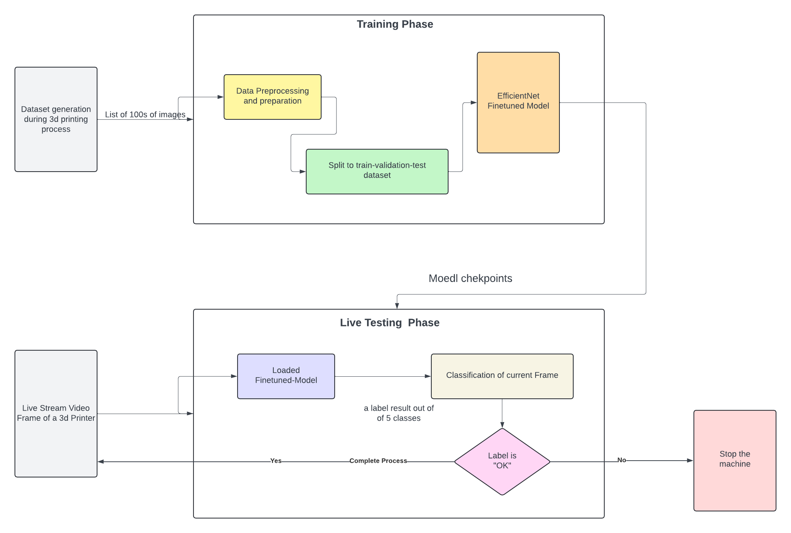
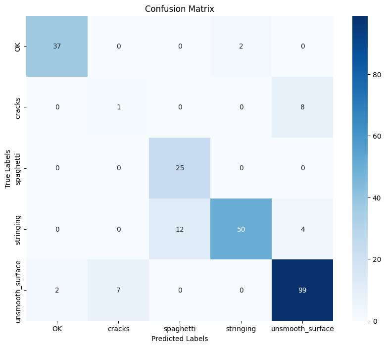
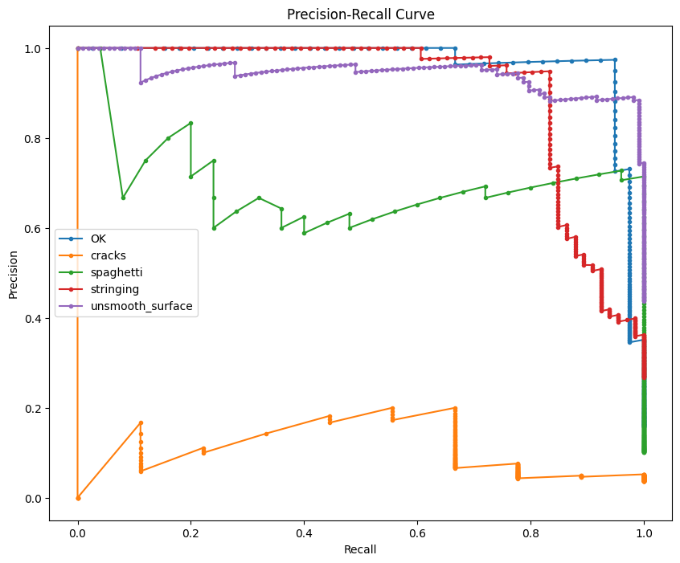

# Anomaly Detection Model for 3D Printing Process using EfficientNet


<!---
()
-->

This project implements an anomaly detection model for monitoring the 3D printing process. The model is based on the EfficientNet architecture and is trained using PyTorch.

## Overview

Add an overview of the project here. Describe the problem you're addressing with the anomaly detection model in the context of the 3D printing process. Explain the importance of monitoring and detecting anomalies in real-time to ensure quality and efficiency in the printing process.



## Features

- **EfficientNet-based Model**: Utilizes the EfficientNet architecture for anomaly detection.
- **Training and Evaluation**: Train and evaluate the model using provided data.
- **Result Analysis**: Analyze model performance using metrics such as precision, recall, F1-score, and confusion matrix.

## Folder Structure and Files

The project folder structure is organized as follows:

- **data**: This directory contains the dataset used for training and evaluation.
  - **train**: Training dataset images.
  - **validate**: Validate dataset images.
  - **test**: Test dataset images.
- **models**: This directory contains the model architecture and related files.
  - **anomaly_detection_model.py**: Definition of the anomaly detection model.
- **training**: This directory contains files related to model training.
  - **train.py**: Script for training the model.
- **inference**: This directory contains files related to model inference.
  - **example_usage**: Contains example test images for model inference.
  - **mass_test**: Contains a larger set of test images for bulk inference.
- **evaluation**: This directory contains files for evaluating the trained model.
  - **analyze_results.py**: Functions for result analysis.
- **utils**: This directory contains utility files used across the project.
  - **data_setup.py**: Setup and preprocessing of the dataset.
  - **data_loader.py**: Custom Loader for batched loading
  - **predict_utils.py**: Utility functions for model inference.
- **main.py**: Main script for training and evaluating the model.

### Training

To train the model, run the following command:

```bash
python3 main.py --train
```

## Evaluation

To evaluate the trained model, run the following command:

```bash
python3 main.py --evaluate
```

## Results

### Confusion Matrix



### Precision-Recall Curve


